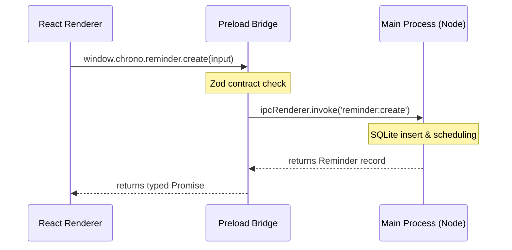

# Secure IPC & Bridge System

ChronoChime leverages a multi-process architecture separated by a secure boundary. The renderer process acts as a sandboxed user interface, while the main process handles all timing, database transactions, and OS hooks.

## Process Boundary Flow

## Load-Bearing Mechanics

### 1. Preload Exclusivity & Sandboxing
The preload script [src/preload.ts](file:///home/vijaykoushik/Evee/My%20Documents/GitHub/chrono-chime-desktop/src/preload.ts) uses Electron's `contextBridge` to expose a restricted API window (`window.chrono`) to the renderer. 
- **No Node I/O in Renderer:** The renderer has zero direct access to the filesystem, network, database, or Electron modules.
- **`contextIsolation`:** Fully enabled to prevent the renderer from escaping the sandbox.

### 2. Isomorphic Zod Contracts
All communication across the IPC boundary is governed by [contract.ts](file:///home/vijaykoushik/Evee/My%20Documents/GitHub/chrono-chime-desktop/src/shared/contract.ts).
- Requests and responses must match structural schemas.
- Invalid IPC payloads are immediately rejected at the preload/main boundary before executing database queries, securing the application from unexpected renderer-process memory exploits.
