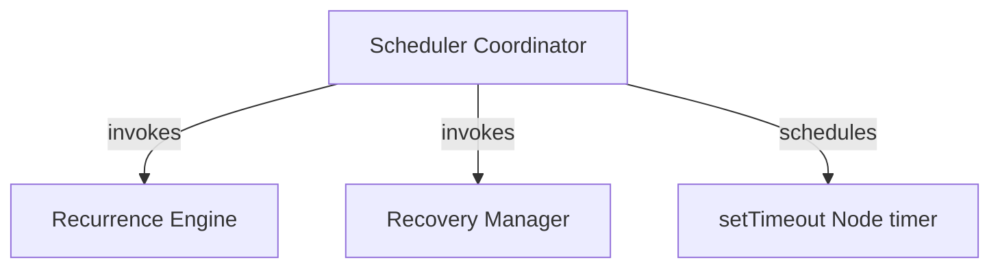

# Core Scheduling System

The Core Scheduling System is responsible for resolving *when* a user notification should fire and executing the trigger accurately without drift, regardless of system interruptions, sleep cycles, or OS restarts.

## Subsystems

### 1. [Scheduler Coordinator](file:///home/vijaykoushik/Evee/My%20Documents/GitHub/chrono-chime-desktop/src/main/scheduler/scheduler.ts)
- **Responsibility:** Manages the active timing loop in the Electron main process.
- **Key Logic:** Drives execution using absolute UTC epoch milliseconds and maintains only a single active timer at any given time.
- **Drift Prevention:** Recalculates the exact wait duration before arming every timer to prevent cumulative delays associated with recursive intervals.

### 2. [Recurrence Engine](recurrence_engine.md)
- **Responsibility:** Pure mathematical logic for calculating timezone-aware future occurrences using Luxon.

### 3. [Recovery Manager](boot_recovery.md)
- **Responsibility:** Coalesces and recovers missed events after system shut-downs or suspended sleep modes.
