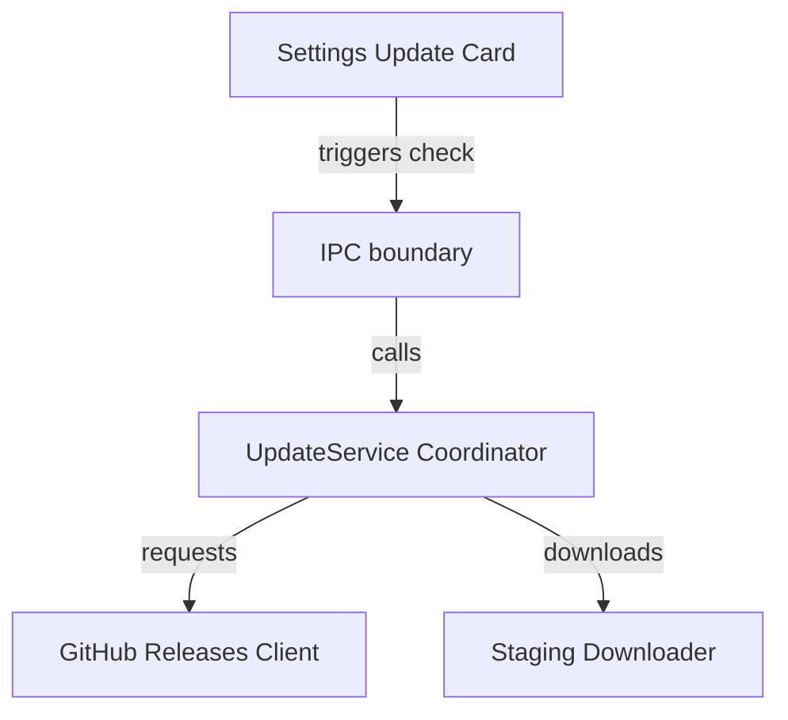

# Application Updates System

ChronoChime implements a user-initiated pull-based updates checker that pulls release tags, downloads installer binaries, validates checksums, and launches platform-native installations.

## Subsystems

### 1. [GitHub Releases Client](../../../src/main/update/github-client.ts)
- **Stable Channel:** Queries `/releases/latest` for public tags.
- **Beta/Prerelease Channel:** Queries `/releases`, filters out drafts, and selects the newest build tag.

### 2. [Staging Downloader](staged_downloader.md)
- **Responsibility:** Handles range resumes, integrity checks, and file renaming.
